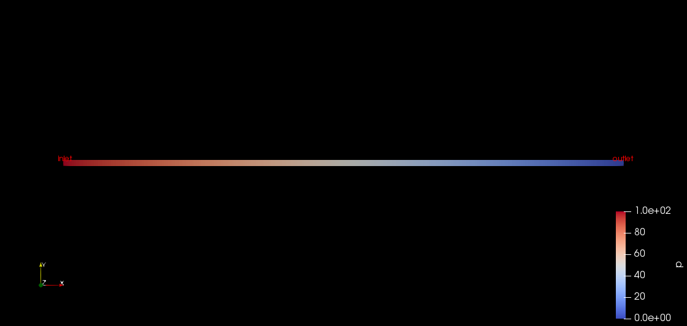

# OpenFoam-DarcySolver
This is an OpenFoam Solver to solve the Darcy Equation for Velocity and Pressure 
This is inspired & guided from the tutorial of "Introduction to open-source computational fluid dynamics using OpenFOAM®" by Cyprien Soulaine
technology.

The Solver in a homogenous Porous Meduim is Darcy Foam.

The Solver for a hetrogenous Porous Meduim is Hetrogenous Darcy Foam

Results of Darcy Foam Solver : 

 Initail Condition for darcyFoam
Pressure Feild for darcyFoam

Results of Hetrogenous Darcy Foam Solver: 

 Initial Setup of Plate with different Porousity Values 
 Resultant Pressure Feild
 Resultant Velocity Feild
